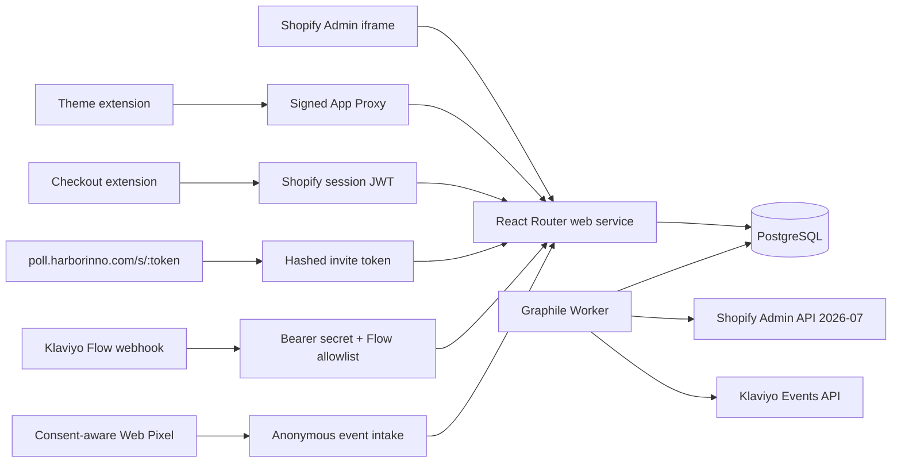

# Architecture

Shopoll's current production profile is a custom-distribution, single-merchant
Harbor dogfood application. The same source repository is public, but a future
public App Store product must be a separate Shopify app and deployment so its
credentials, data and merchant lifecycle cannot mix with Harbor's dogfood
environment.

## Versioning

`Survey.draftDefinition` is editable. Publishing validates every enabled locale,
cycles and reachability, then creates a new immutable `SurveyVersion` and points
`activeVersionId` to it. Every response keeps its version and question/option
snapshot, so later copy edits never alter historical reporting.

## Public flow

1. Resolve the highest-priority eligible placement.
2. Create or resume a response session.
3. Save each answer with an idempotency key.
4. Complete the session exactly once.
5. Queue an eligible reward exactly once.

Public endpoints return only the localized published definition needed by the
current surface. Contact answers are encrypted with AES-256-GCM and omitted from
standard analytics and CSV exports.

## Authentication boundaries

| Surface | Authentication |
| --- | --- |
| App Home | App Bridge session token via `authenticate.admin` |
| Checkout | Shopify-signed JWT bearer token plus order confirmation-number hash proof |
| Theme | Shopify App Proxy HMAC signature |
| Standalone | 256-bit opaque invite token; database stores SHA-256 hash |
| Klaviyo Flow | Dedicated bearer secret and Flow ID allowlist |

## Data boundaries

Order facts contain encrypted/hashed order GID, a one-way order confirmation
number hash, products/variants, amount, currency, market, locale, coarse
new/returning grouping, source and UTM fields. The confirmation number itself is
never persisted. Order facts do not contain customer contact details, names or
addresses. Reported revenue is labelled as correlation, never causal
attribution.
